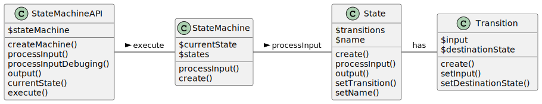

## State Machine
 - This is a software module for generating a finite state machine (FSM).
 - You have to create the machine, add the states, add the transitions and process the input.
 - The input is a string of ones and zeros representing an unsigned binary integer.
 - The output is defined according to the states in which the machine ends.
 - It was created some tests based on the ‘mod-three’ procedure as you can see in `StateMachineAPITest.testModThree`
 - Ex.: (using default mod3 sample)
 ```
 #php index.php 11101
  2
```
Where `11101` is equivalent of 29, and 29 mod 3 = 2.

### API Functions
The API operations are avaialbe in `StateMachineAPI`, the module interface.
| Function | Description | Usage |
| :---:   | :---: |  :---: | 
| `createMachine` | Create the state machine encapsulated.  | `$stateMachine->createMachine()` |  
| `addAlphabet`| Set an array of allowed input in the machine (Σ).| `$stateMachine->addAlphabet(['1','0'])`| 
| `addState`| Add a state to a created machine. Receives the state name, the state output, and if it is an accepeted final state as parameters. | `$stateMachine->addState('S2', 2, true)`| 
| `addTransition`| Add a transition to a created machine. Receives the state source, the input, and the state destination as parameters. | `$stateMachine->addTransition('S0','0', 'S0')`| 
| `startState` | Set initial state for the state machine. | ` $stateMachine->startState('S0')`| 
| `processInput` | Process the input string returning an output. | `$stateMachine->processInput($argv[1])`| 
| `output` | Return current state output.  |  `$stateMachine->output()` |
| `isValidFinal` | Check if the final state is accepeted as final state .|  `$stateMachine->isValidFinal()` |  

### Usage

```
  $stateMachine = new StateMachineAPI();
  $stateMachine->createMachine();

  $stateMachine->addState('S1', 1, true);
  $stateMachine->addState('S0', 0, true);
  $stateMachine->addState('S2', 2, true);

  $stateMachine->addAlphabet(['1','0']);     

  $stateMachine->addTransition('S0','0', 'S0');
  $stateMachine->addTransition('S0','1', 'S1');

  $stateMachine->addTransition('S1','0', 'S2');
  $stateMachine->addTransition('S1','1', 'S0');

  $stateMachine->addTransition('S2','0', 'S1');
  $stateMachine->addTransition('S2','1', 'S2');

  $stateMachine->startState('S0');

  $result = $stateMachine->processInput($argv[1]);
```
You can test it executing the sample index.php file:
  - Inside the container: `php index.php 10101` 
  - Outside Container: `docker-compose exec web php index.php 10101`

## About the code

### Data Structure
The data structure used in the solution was `Hashmap`.
Used in:
 - StateMachine: find/store the proper state
 - State: find/store the proper transition (transition function)

### Classes
 
 - StateMachineAPI: It is an interface with common functions to execute and create the state machine.
 - StateMachine: Entity responsible to process the inputs redirects to a next state.
 - State: Entity manipulated by the state machine.
 - Transition: Value object representing a state transition to another.


### Code style
Using [oskarstark](https://github.com/OskarStark/php-cs-fixer-ga) to autofix phpcs
```
docker run --rm -it -w=/app -v ${PWD}:/app oskarstark/php-cs-fixer-ga:latest
```

## Requirements to run
  - Docker
 
 ## How to Run 
 1. `docker-compose up -d`
 2. `docker-compose exec web bash` (command to get inside the container)
 3. `composer install` (inside container)
 4. `php index.php 10101`

## Tests
  - Inside the container: `vendor/bin/phpunit --testdox` or;
  - Outside Container: `docker-compose exec web vendor/bin/phpunit --testdox`

```
oot@148e85c210e4:/var/www/html# vendor/bin/phpunit --testdox
PHPUnit 10.0.0 by Sebastian Bergmann and contributors.

Runtime:       PHP 8.1.25
Configuration: /var/www/html/phpunit.xml

.........................                                         25 / 25 (100%)

Time: 00:00.387, Memory: 6.00 MB

State Machine API (Tests\StateMachineAPI)
 ✔ Mod three with "110"
 ✔ Mod three with "1101"
 ✔ Mod three with "1110"
 ✔ Mod three with empty·input
 ✔ Mod three with "0"
 ✔ Mod three with "1"
 ✔ Mod three with big·number

State Machine (Tests\StateMachine)
 ✔ Start without states
 ✔ Invalid initial state machine
 ✔ State without output
 ✔ State with output
 ✔ Add transitions without state
 ✔ Add transitions without alphabet
 ✔ Add transitions with invalid alphabet
 ✔ Add transition
 ✔ Invalid process input
 ✔ Process invalid next state input
 ✔ Process input is not string
 ✔ Process input machine not started
 ✔ Process input

State (Tests\State)
 ✔ Create state
 ✔ Process wrong input
 ✔ Process input

Transitions (Tests\Transitions)
 ✔ Input is not string
 ✔ Create transition

OK (25 tests, 46 assertions)
```
